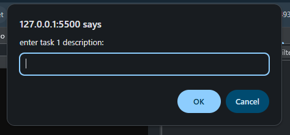
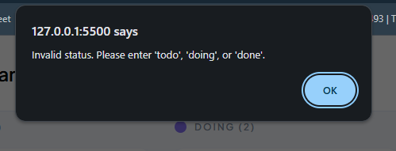

# Kanban Task Management: Task Input and Status Validation System

## 📌Project Description

This project is a web-based Kanban task management tool designed to help users organise and track their work visually.

The interface is built with clean, semantic HTML and styled with CSS to resemble a professional Kanban board. The JavaScript logic handles user prompts, validates inputs, and outputs results to the console.
---

## ✨ Features
- **Interactive Task Input** - On page load, the application automatically prompts the user to enter a title, description, and status for two tasks.
- **Status Validation** - Only three statuses are accepted: todo, doing, or done. If the user enters anything else, an alert appears and they must try again.
- **Case-Insensitive Handling** - Status entries like "Todo", "DONE", or "Doing" are all accepted and converted to lowercase for consistency.
- **Console Output** If there are completed tasks (status: "done"), their title and status are displayed in the console.
- **Clean, Maintainable Code** - HTML, CSS, and JavaScript are separated into dedicated files, following best practices for readability and maintainability.

### Technologies

- **HTML5** – Semantic structure and layout.
- **CSS3** – Styling, colours, and responsive design.
- **JavaScript (ES6)** – Dynamic functionality, prompts, validation, and console output.

## 🚀 Setup Instructions

1. **Clone the repository** git clone [repository-url]
2. **Open the project folder** Navigate to the directory where the files are stored
3. **Run locally** Open index.html in your preferred browser (Chrome, Firefox, etc.). The task input prompts will appear automatically.

## Expected Outcome
A functional task entry system that ensures accurate data collection, validation, and structured storage while maintaining clean and well-documented code for easy future modifications.

**Prompt Input**

- Enter task details - Provide a title, description, and status

   

**Invalid status**

- If the status is invalid (e.g., "in progress"), you’ll see an alert and be asked again.

  

**Console log**

- A list of completed tasks:

  

- Motivational message when no completed task:

  
